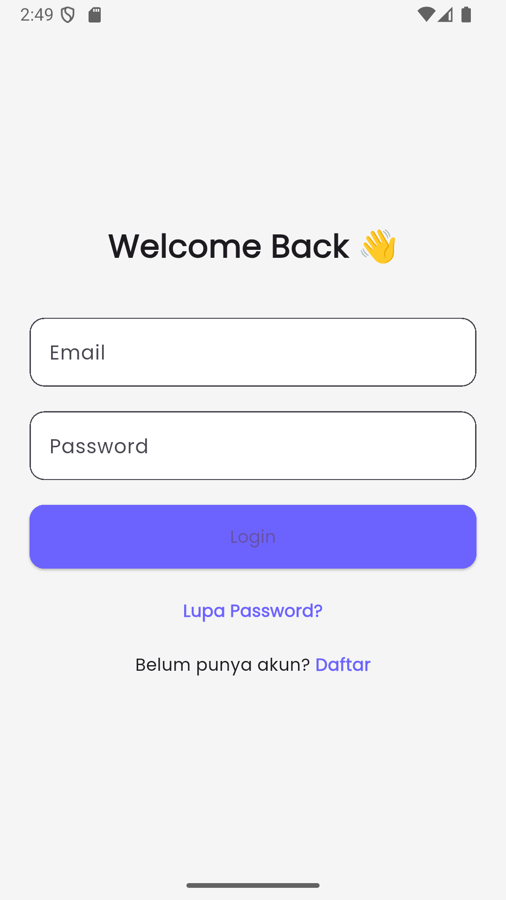
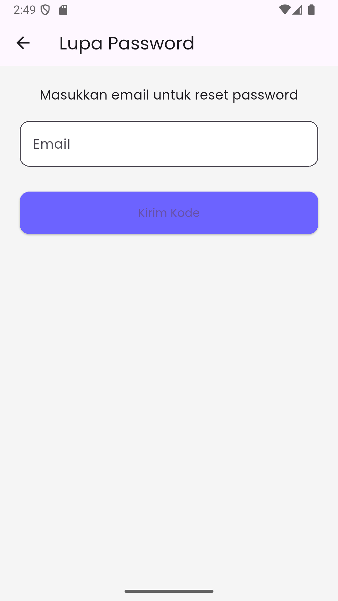
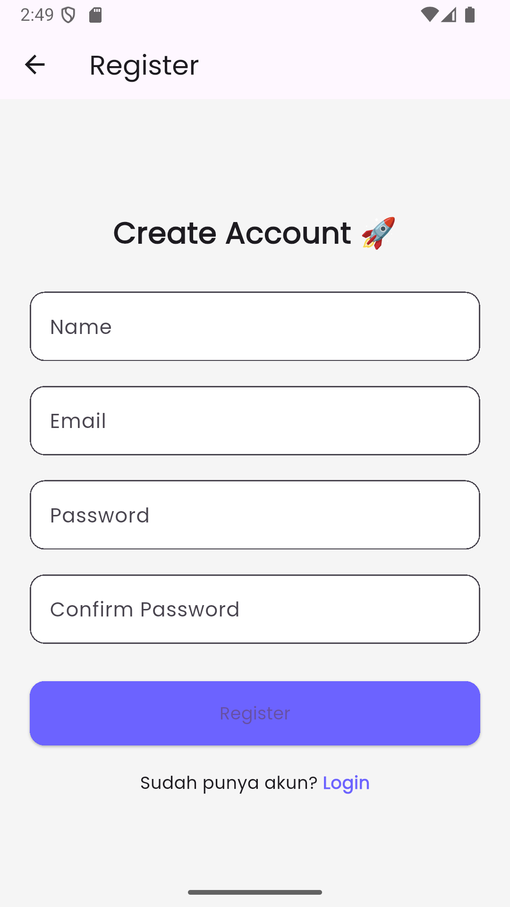
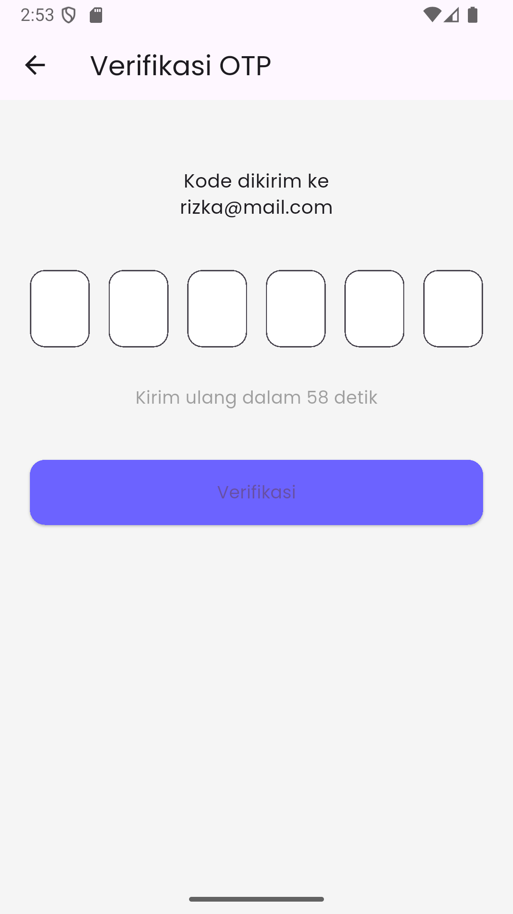
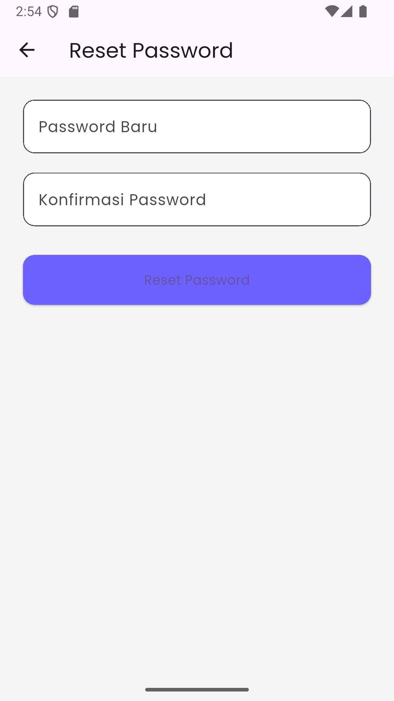
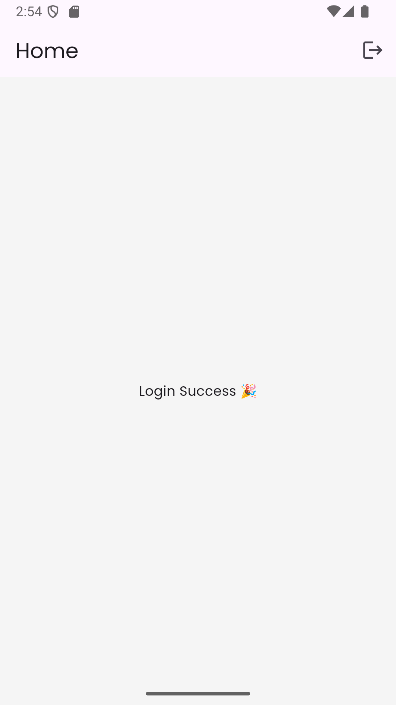

# 🔐 Flutter + Laravel Auth System (Login, Register, Reset OTP)

Project ini merupakan sistem autentikasi menggunakan:

- 🎯 Backend: Laravel 10 (REST API + Sanctum)
- 📱 Frontend: Flutter (Android)
- 🗄 Database: MySQL
- 📧 Email: Mailtrap (Development)

Fitur:
- Register
- Login
- Logout
- Forgot Password (OTP via Email)
- Verifikasi OTP (6 digit modern UI)
- Reset Password
- Auto resend OTP (60 detik)

---

# 📱 Tampilan Aplikasi

<p align="center">
  
  
  
  
  
  
</p>


---

# 📱 SETUP FRONTEND (Flutter)

Masuk ke folder frontend:

```bash
cd login_flutter
```

## 1️⃣ Install Dependency

```bash
flutter pub get
```

## 2️⃣ Konfigurasi Base URL

Edit:

```
lib/core/constants/api_constants.dart
```

Jika menggunakan emulator Android:

```
static const String baseUrl = "http://10.0.2.2:8000/api";
```

Jika menggunakan device fisik:

```
static const String baseUrl = "http://192.168.X.X:8000/api";
```

(Ganti dengan IP komputer Anda)

## 3️⃣ Jalankan Emulator Android

Buka Android Studio → Device Manager → Start Emulator

## 4️⃣ Jalankan Aplikasi

```bash
flutter run
```

---

# 🔐 FLOW RESET PASSWORD

1. User klik "Lupa Password"
2. Input Email
3. Backend kirim OTP (6 digit) ke email
4. User input OTP (UI 6 box modern)
5. Verifikasi OTP
6. User reset password
7. Login ulang

---

# 📂 STRUKTUR FOLDER FLUTTER

```
lib/
│
├── core/
│   ├── constants/
│   ├── theme/
│   └── utils/
│
├── data/
│   ├── models/
│   └── services/
│
├── presentation/
│   ├── screens/
│   └── widgets/
│
└── routes/
```

---

# 🛡 KEAMANAN

- Password disimpan menggunakan Hash (bcrypt)
- OTP memiliki masa berlaku 10 menit
- OTP dihapus setelah reset password
- Token login menggunakan Laravel Sanctum

---

# 🧪 TESTING

Gunakan Postman untuk testing API.

Pastikan header:

```
Accept: application/json
```

---

# 🐞 TROUBLESHOOTING

### 1️⃣ Email tidak terkirim
- Periksa konfigurasi Mailtrap
- Jalankan: php artisan config:clear

### 2️⃣ Flutter tidak bisa connect ke backend
- Pastikan backend berjalan
- Gunakan 10.0.2.2 untuk emulator

### 3️⃣ Migration error
- Pastikan database sudah dibuat

---

# 📦 INSTALL DI MESIN BARU

Langkah cepat:

Backend:

```bash
composer install
cp .env.example .env
php artisan key:generate
php artisan migrate
php artisan serve
```

Frontend:

```bash
flutter pub get
flutter run
```

---

# 👨‍💻 Developer Notes

Project ini dibuat untuk memenuhi requirement:

- Fullstack Auth System
- REST API
- OTP Verification
- Flutter UI Modern
- Siap dijalankan di mesin baru hanya dengan README

---

# 📞 Kontak Developer

Apabila terdapat pertanyaan, kendala instalasi, bug, atau kebutuhan pengembangan lebih lanjut, silakan hubungi:

**Nama Developer:**  
Rizka Parhansyah  

**Email:**  
rizka.parhan@gmail.com  

**WhatsApp:**  
wa.me/+6285930466410

Silakan sertakan informasi berikut saat menghubungi:

- Sistem Operasi yang digunakan
- Versi Flutter & PHP
- Screenshot error
- Log error (jika ada)
- Langkah yang dilakukan sebelum error muncul

Agar proses troubleshooting dapat dilakukan lebih cepat dan akurat.

---


# 📄 Lisensi

Project ini hanya untuk kebutuhan pembelajaran / submission.


